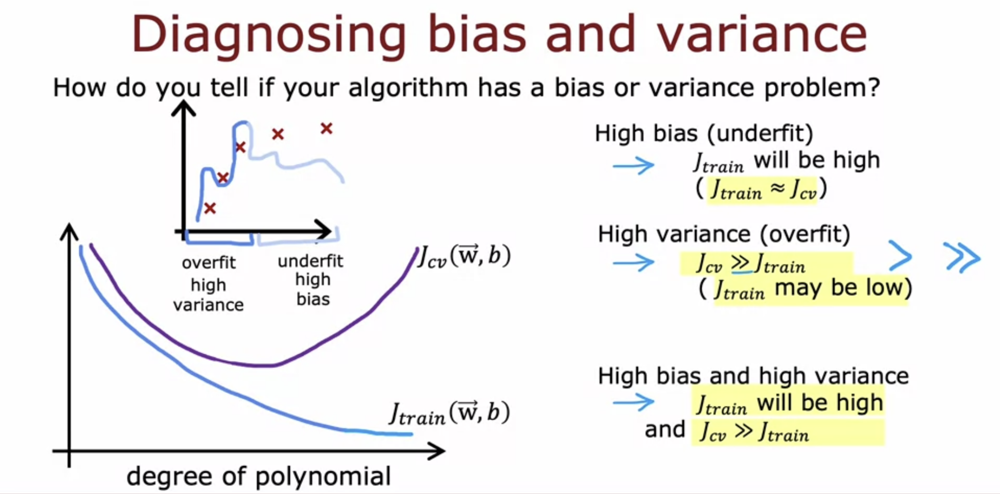

# Diagnosing bias and variance

##

Bias refers to an algorithm that underfits the data, while variance refers to an algorithm that overfits the data. To diagnose bias and variance the performance of the algorithm is evaluated on the training set and the cross-validation set. High bias is indicated when the algorithm performs poorly on the training set, while high variance is indicated when the algorithm performs much worse on the cross-validation set compared to the training set. [[Regularization and bias-variance]] Regularization can affect the bias and variance of a learning algorithm.

Bias and variance are two important concepts that help us understand the behavior and performance of the model.

- Bias: Bias refers to the error introduced by approximating a real-world problem with a simplified model. A model with high bias tends to underfit the data, meaning it oversimplifies the relationships between the input features and the target variable. It fails to capture the complexity of the data and makes overly generalized assumptions. High bias can result in poor performance on both the training and test data.
- Variance: Variance, on the other hand, refers to the sensitivity of the model to the fluctuations in the training data. A model with high variance tends to overfit the data, meaning it captures noise and random fluctuations in the training data, leading to poor generalization on unseen data. It is overly complex and adapts too much to the training data, resulting in a lack of flexibility.

In summary, bias is related to the model's ability to capture the underlying patterns in the data, while variance is related to the model's sensitivity to the noise and fluctuations in the training data. Balancing bias and variance is crucial for building a well-performing machine learning model.

When looking at the performance of an algorithm on the training set and cross-validation set, there are indicators that can help identify whether the algorithm has high bias or high variance:

1. High Bias (Underfitting):

   - Indicator: The algorithm performs poorly on the training set.
   - Observation: The training error (J_train) is high, indicating that the algorithm is not fitting the training data well.
   - Implication: The algorithm is oversimplified and fails to capture the underlying patterns in the data.

2. High Variance (Overfitting):

   - Indicator: The algorithm performs much worse on the cross-validation set compared to the training set.
   - Observation: The cross-validation error (J_cv) is significantly higher than the training error (J_train).
   - Implication: The algorithm is too complex and adapts too much to the training data, resulting in poor generalization to unseen data.

It's important to note that these indicators are not mutually exclusive. In some cases, an algorithm can exhibit both high bias and high variance simultaneously, although it's more common to primarily have one or the other.

By analyzing the performance on the training set and cross-validation set, you can gain insights into whether your algorithm is suffering from bias or variance issues. This understanding can guide you in making improvements to enhance the algorithm's performance.

High bias in a machine learning algorithm can significantly impact its performance. Here's how:

1. Underfitting: High bias is indicative of an algorithm that underfits the data. It means that the algorithm oversimplifies the relationships between the input features and the target variable. As a result:

   - Performance on Training Set: The algorithm performs poorly on the training set, with a high training error. It fails to capture the underlying patterns and nuances in the data.
   - Performance on Test Set: The algorithm is likely to perform poorly on unseen data as well. It lacks the complexity and flexibility to generalize well beyond the training set.

2. Inadequate Model Complexity: High bias often arises from using a model that is too simple or making overly generalized assumptions. This can lead to an inadequate representation of the underlying data distribution.

3. Underutilization of Available Information: An algorithm with high bias may not effectively utilize all the available information in the data. It may overlook important features or fail to capture complex relationships, resulting in suboptimal predictions.

4. Inability to Learn Complex Patterns: High bias limits the algorithm's ability to learn complex patterns and make accurate predictions. It may oversimplify the relationships, leading to an overly generalized model that cannot capture the intricacies of the data.

To address high bias, it is necessary to consider more complex models, increase the model's capacity, or introduce additional features to capture the underlying complexity of the data. By reducing bias, the algorithm can better fit the training data and improve its performance on both the training and test sets.

To diagnose whether an algorithm has high bias or high variance, you can analyze its performance on the training set and the cross-validation set. Here's how you can do it:

1. High Bias (Underfitting):

   - Training Set Performance: If the algorithm has high bias, it will perform poorly on the training set. The training error (J_train) will be high, indicating that the algorithm is not fitting the training data well.
   - Cross-Validation Set Performance: Check the performance of the algorithm on the cross-validation set. If the cross-validation error (J_cv) is also high and similar to the training error, it suggests that the algorithm is underfitting and has high bias.

2. High Variance (Overfitting):

   - Training Set Performance: The algorithm with high variance will typically perform well on the training set. The training error (J_train) will be low because it can fit the training data well.
   - Cross-Validation Set Performance: However, when evaluating the algorithm on the cross-validation set, if the cross-validation error (J_cv) is significantly higher than the training error, it indicates that the algorithm is overfitting and has high variance.

By comparing the performance on the training set and the cross-validation set, you can gain insights into whether the algorithm is suffering from high bias or high variance. If the algorithm has high bias, it needs more complexity or features to capture the underlying patterns. If it has high variance, it needs regularization or simplification to reduce overfitting.

Understanding whether an algorithm has high bias or high variance is crucial for making appropriate adjustments to improve its performance and achieve better generalization to unseen data.
