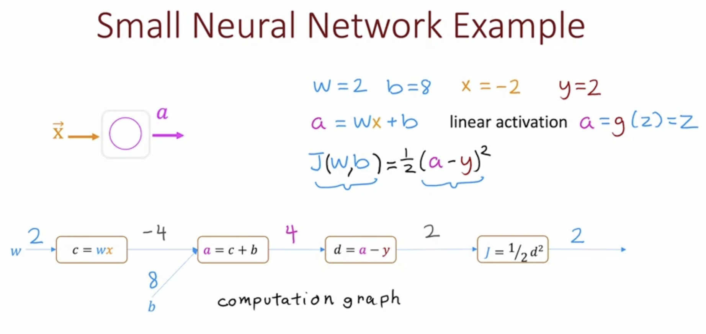

This computation graph shows the forward propogation steps to compute the output of a neural network.

[Understanding Backprop](https://towardsdatascience.com/understanding-backpropagation-algorithm-7bb3aa2f95fd)
