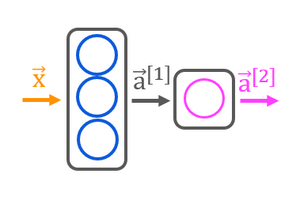
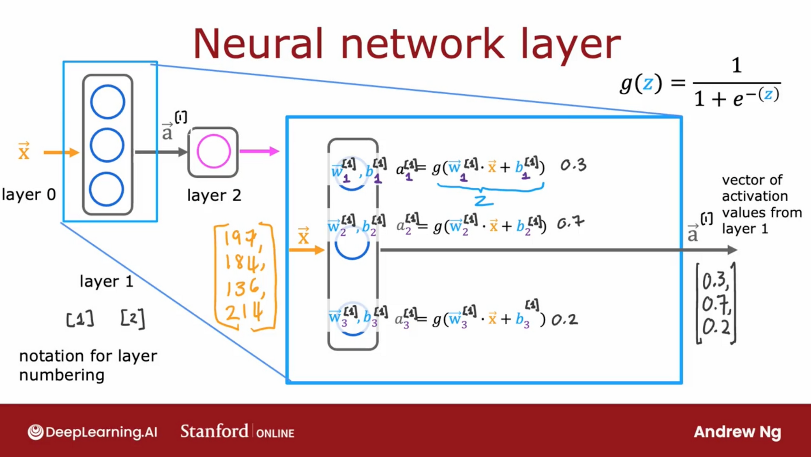
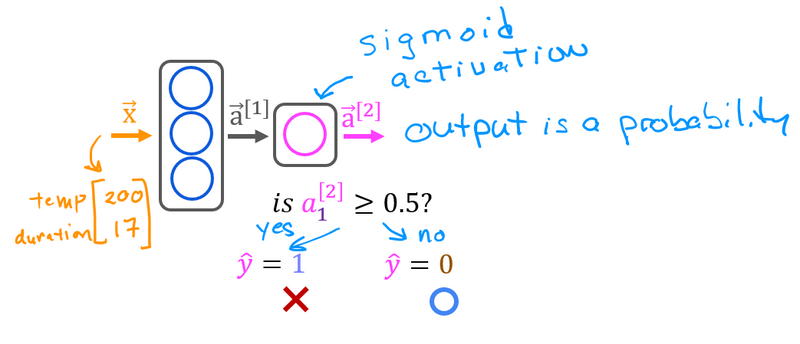

# Neural network model

$$a_j^{[l]}=g(w_j^{[l]} \cdot a^{[l-1]} + b_j^{[l]})$$

$g$ is the activation (sigmoid) function

$j$ is the unit neuron

$l$ is the neuron layer

- Neural network inference uses forward propogation algorithm.
- Forward propogation algorithm refers to left to right procession of computation across layers in the neural network architecture.

## Numpy Model (Forward Prop in NumPy)


A layer simply contains multiple neurons/units. One can utilize a for loop to visit each unit (`j`) in the layer and perform the dot product of the weights for that unit (`W[:,j]`) and sum the bias for the unit (`b[j]`) to form `z`. An activation function `g(z)` can then be applied to that result. Let's try that below to build a "dense layer" subroutine.

First, you will define the activation function `g()`.

```python
import numpy as np
import matplotlib.pyplot as plt

def sigmoid(z):
    """
    Compute the sigmoid of z
    Args:
        z (ndarray): A scalar, numpy array of any size.
    Returns:
        g (ndarray): sigmoid(z), with the same shape as z
    """

    g = 1/(1+np.exp(-z))
    return g

```

Next, you will define the `my_dense()` function which computes the activations of a dense layer.

```python
def my_dense(a_in, W, b):
    """
    Computes dense layer
    Args:
      a_in (ndarray (n, )) : Data, 1 example
      W    (ndarray (n,j)) : Weight matrix, n features per unit, j units
      b    (ndarray (j, )) : bias vector, j units
    Returns
      a_out (ndarray (j,))  : j units|
    """
    units = W.shape[1]
    a_out = np.zeros(units)
    for j in range(units):
        w = W[:,j]
        z = np.dot(w, a_in) + b[j]
        a_out[j] = sigmoid(z)
    return(a_out)
```

_Note:_ You can also implement the function above to accept `g` as an additional parameter (e.g. `my_dense(a_in, W, b, g)`). In this notebook though, you will only use one type of activation function (i.e. sigmoid) so it's okay to make it constant and define it outside the function. That's what you did in the code above and it makes the function calls in the next code cells simpler. Just keep in mind that passing it as a parameter is also an acceptable implementation. You will see that in this week's assignment.

The following cell builds a two-layer neural network utilizing the `my_dense` subroutine above.

```python
def my_sequential(x, W1, b1, W2, b2):
    a1 = my_dense(x,  W1, b1)
    a2 = my_dense(a1, W2, b2)
    return(a2)
```

We can copy trained weights and biases from the previous lab in Tensorflow.

```python
W1_tmp = np.array( [[-8.93,  0.29, 12.9 ], [-0.1,  -7.32, 10.81]] )
b1_tmp = np.array( [-9.82, -9.28,  0.96] )
W2_tmp = np.array( [[-31.18], [-27.59], [-32.56]] )
b2_tmp = np.array( [15.41] )
```


Once you have a trained model, you can then use it to make predictions. Recall that the output of our model is a probability. In this case, the probability of a good roast. To make a decision, one must apply the probability to a threshold. In this case, we will use 0.5. Let's start by writing a routine similar to Tensorflow's `model.predict()`. This will take a matrix $X$ with all $m$ examples in the rows and make a prediction by running the model.

```python
def my_predict(X, W1, b1, W2, b2):
    m = X.shape[0]
    p = np.zeros((m,1))
    for i in range(m):
        p[i,0] = my_sequential(X[i], W1, b1, W2, b2)
    return(p)
```

We can try this routine on two examples:

```python
X_tst = np.array([
    [200,13.9],  # postive example
    [200,17]])   # negative example
X_tstn = norm_l(X_tst)  # remember to normalize
predictions = my_predict(X_tstn, W1_tmp, b1_tmp, W2_tmp, b2_tmp)
```

To convert the probabilities to a decision, we apply a threshold:

```python
yhat = np.zeros_like(predictions)
for i in range(len(predictions)):
    if predictions[i] >= 0.5:
        yhat[i] = 1
    else:
        yhat[i] = 0
print(f"decisions = \n{yhat}")
```

This can be accomplished more succinctly:

```python
yhat = (predictions >= 0.5).astype(int)
print(f"decisions = \n{yhat}")
```

## Tensorflow and Keras

Tensorflow is a machine learning package developed by Google. In 2019, Google integrated Keras into Tensorflow and released Tensorflow 2.0. Keras is a framework developed independently by François Chollet that creates a simple, layer-centric interface to Tensorflow. This course will be using the Keras interface.

```python
import numpy as np
import matplotlib.pyplot as plt
import tensorflow as tf
from tensorflow.keras.layers import Dense, Input
from tensorflow.keras import Sequential
from tensorflow.keras.losses import MeanSquaredError, BinaryCrossentropy
from tensorflow.keras.activations import sigmoid
tf.autograph.set_verbosity(0)

X_train = np.array([[1.0], [2.0]], dtype=np.float32)           #(size in 1000 square feet)
Y_train = np.array([[300.0], [500.0]], dtype=np.float32)       #(price in 1000s of dollars)

fig, ax = plt.subplots(1,1)
ax.scatter(X_train, Y_train, marker='x', c='r', label="Data Points")
ax.legend( fontsize='xx-large')
ax.set_ylabel('Price (in 1000s of dollars)', fontsize='xx-large')
ax.set_xlabel('Size (1000 sqft)', fontsize='xx-large')
plt.show()
```

## Regression/Linear Model

The function implemented by a neuron with no activation is linear regression:
$$f_{\mathbf{w},b}(x^{(i)}) = \mathbf{w}\cdot x^{(i)} + b \tag{1}$$We can define a layer with one neuron or unit and compare it to the familiar linear regression function.

```python
linear_layer = tf.keras.layers.Dense(units=1, activation = 'linear', )
linear_layer.get_weights()
```

There are no weights as the weights are not yet instantiated. By training the model with e.g., one sample in`X_train` the weights are instantiated. Note, the input to the layer must be 2-D, so we'll reshape it.

```python
a1 = linear_layer(X_train[0].reshape(1,1))
print(a1)
```

The result is a tensor (another name for an array) with a shape of (1,1) or one entry.
Now let's look at the weights and bias. These weights are randomly initialized to small numbers and the bias defaults to being initialized to zero.

```python
w, b= linear_layer.get_weights()
print(f"w = {w}, b={b}")
```

A linear regression model (1) with a single input feature will have a single weight and bias. This matches the dimensions of our `linear_layer` above.

The weights are initialized to random values so let's set them to some known values.

```python
set_w = np.array([[200]])
set_b = np.array([100])

# set_weights takes a list of numpy arrays
linear_layer.set_weights([set_w, set_b])
print(linear_layer.get_weights())
```

Let's compare equation (1) to the layer output.

```python
a1 = linear_layer(X_train[0].reshape(1,1))
print(a1)
alin = np.dot(set_w,X_train[0].reshape(1,1)) + set_b
print(alin)
```

They produce the same values!

Now, we can use our linear layer to make predictions on our training data.

```python
prediction_tf = linear_layer(X_train)
prediction_np = np.dot( X_train, set_w) + set_b
```

## Neuron with Sigmoid activation

The function implemented by a neuron/unit with a sigmoid activation is the same as in Course 1, logistic regression:
$$f_{\mathbf{w},b}(x^{(i)}) = g(\mathbf{w}x^{(i)} + b) \tag{2}$$
where $$g(x) = sigmoid(x)$$

Let's set $w$ and $b$ to some known values and check the model.

```python
X_train = np.array([0., 1, 2, 3, 4, 5], dtype=np.float32).reshape(-1,1)  # 2-D Matrix
Y_train = np.array([0,  0, 0, 1, 1, 1], dtype=np.float32).reshape(-1,1)  # 2-D Matrix

pos = Y_train == 1
neg = Y_train == 0
X_train[pos]

pos = Y_train == 1
neg = Y_train == 0

fig,ax = plt.subplots(1,1,figsize=(4,3))
ax.scatter(X_train[pos], Y_train[pos], marker='x', s=80, c = 'red', label="y=1")
ax.scatter(X_train[neg], Y_train[neg], marker='o', s=100, label="y=0", facecolors='none',
              edgecolors=dlc["dlblue"],lw=3)

ax.set_ylim(-0.08,1.1)
ax.set_ylabel('y', fontsize=12)
ax.set_xlabel('x', fontsize=12)
ax.set_title('one variable plot')
ax.legend(fontsize=12)
plt.show()
```

## Logistic Neuron

We can implement a 'logistic neuron' by adding a sigmoid activation. The function of the neuron is then described by (2) above.  
This section will create a Tensorflow Model that contains our logistic layer to demonstrate an alternate method of creating models. Tensorflow is most often used to create multi-layer models. The [Sequential](https://keras.io/guides/sequential_model/) model is a convenient means of constructing these model

```python
model = Sequential(
    [
        tf.keras.layers.Dense(1, input_dim=1,  activation = 'sigmoid', name='L1')
    ]
)
model.summary()
```

`model.summary()` shows the layers and number of parameters in the model. There is only one layer in this model and that layer has only one unit. The unit has two parameters, $w$ and $b$.

```python
logistic_layer = model.get_layer('L1')
w,b = logistic_layer.get_weights()
print(w,b)
print(w.shape,b.shape)
```

Set the weight and bias to some known values

```python
set_w = np.array([[2]])
set_b = np.array([-4.5])
# set_weights takes a list of numpy arrays
logistic_layer.set_weights([set_w, set_b])
print(logistic_layer.get_weights())
a1 = model.predict(X_train[0].reshape(1,1))
print(a1)
```
